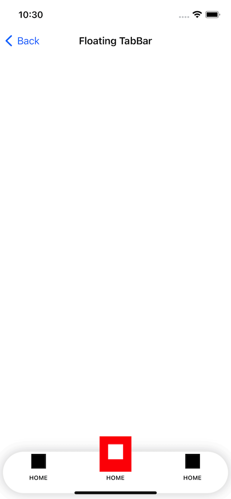

# DPTabBar

[](https://travis-ci.org/DipakPanchasara/DPTabBar)
[](https://cocoapods.org/pods/DPTabBar)
[](https://cocoapods.org/pods/DPTabBar)
[](https://cocoapods.org/pods/DPTabBar)

## Overview

A Custom TabBar for iOS written in Swift.

<p align="center">
  
</p>

<p align="center">
  
</p>

<p align="center">
  
</p>

<p align="center">
  
</p>

## Example

To run the example project, clone the repo, and run `pod install` from the Example directory first.

## Installation

DPTabBar is available through [CocoaPods](https://cocoapods.org). To install
it, simply add the following line to your Podfile:

```ruby
pod 'DPTabBar'
```

### Swift Package Manager

[Swift Package Manager](https://www.swift.org/package-manager/) is a tool for managing the distribution of Swift code. It’s integrated with the Swift build system to automate the process of downloading, compiling, and linking dependencies.

`Xcode 11+` is required to build HelpfulKit using Swift Package Manager.

To integrate HelpfulKit into your Xcode project using Swift Package Manager, add it to the dependencies value of your `Package.swift`:

```bash
  dependencies: [
    .package(url: "https://github.com/DipakPanchasara/DPTabBar.git")
]
```

## Author

Dipak Panchasara, 

## License

DPTabBar is available under the MIT license. See the LICENSE file for more info.
